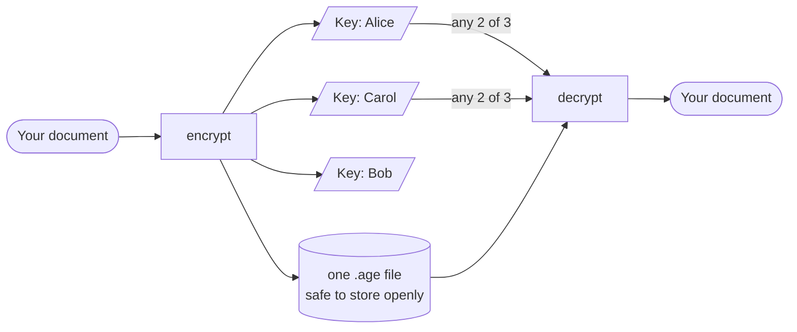
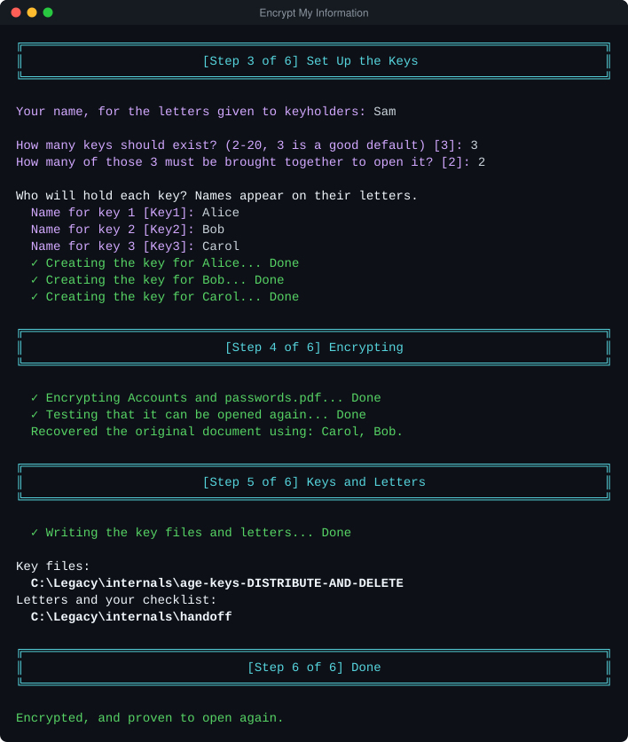
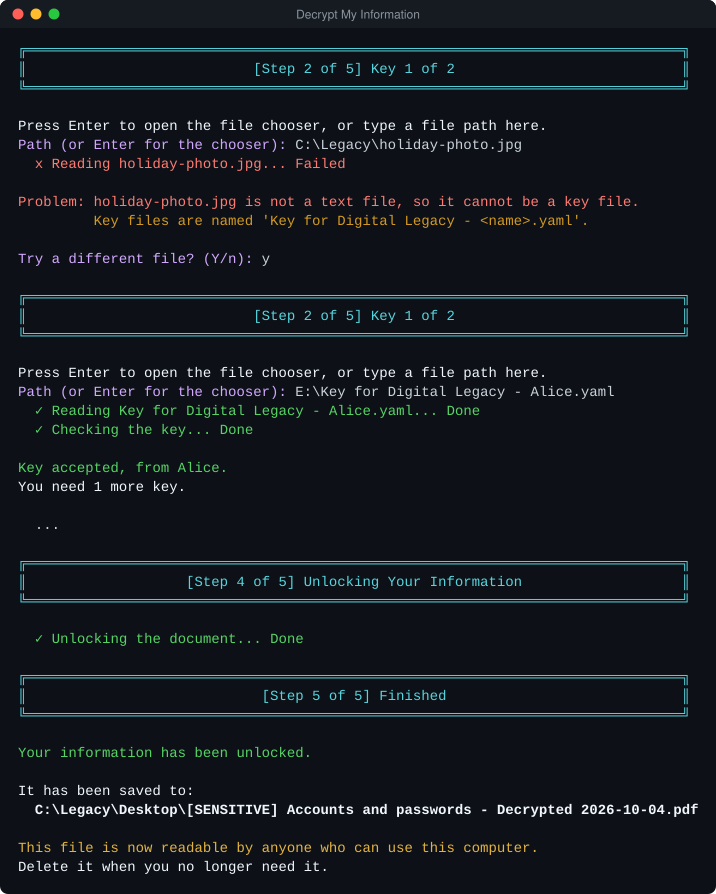
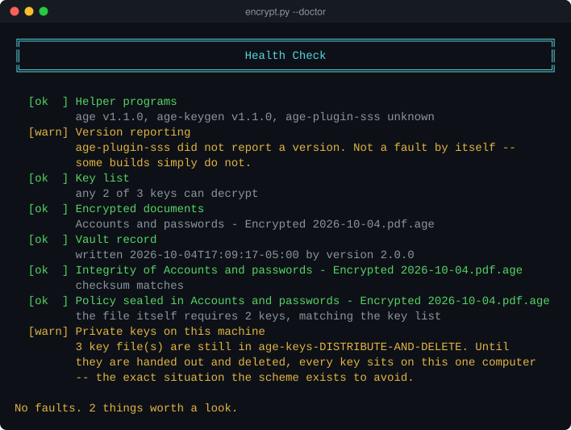

# Digital Legacy Encryption

[](https://github.com/justin-venetucci/digital-legacy-encryption/actions/workflows/ci.yml)


[](LICENSE)

Encrypt a document — a password list, an account inventory, a letter — so that
it can only be opened when **several people bring their keys together**. No
single person can read it alone, and no single person losing their key can lock
everyone else out.

It is built for the moment it will actually be used: by someone non-technical,
probably grieving, doing this once, with nobody to ask.



The cryptography is [`age`](https://age-encryption.org) with
[`age-plugin-sss`](https://github.com/olastor/age-plugin-sss) (Shamir Secret
Sharing). This project is everything around it: the part that decides whether a
family can really get the document back.

## What makes it worth a look

- **It proves recovery before it claims success.** After encrypting, the tool
  decrypts its own output with a random threshold-sized subset of the new keys
  and compares SHA-256 against the original. It will not say "done" until the
  document has demonstrably come back.
- **Errors are written for the person reading them.** Every failure carries a
  plain sentence and a next step, every rejected key file offers another try,
  and no traceback ever reaches the screen.
- **Zero runtime dependencies.** Standard library only, down to a small strict
  parser for the YAML subset the plugin needs. In twenty years a beneficiary
  needs a Python interpreter and three small binaries, not a dependency graph.
- **It survives its own disappearance.** Key files keep the exact format
  `age-keygen` emits and the ciphertext is an ordinary `age` file, so stock
  `age` and the plugin can open it without any of this code.
- **It is honest about its limits.** [SECURITY.md](SECURITY.md) spells out the
  threat model, including what this does *not* protect against.
- **It is tested like it matters.** 161 tests on standard-library `unittest`,
  run in CI on Linux, macOS and Windows against real `age` binaries, including
  one that decrypts the sample vault in this repository on every run.

<p align="center">
  
</p>

And the other end, years later, with a mistake a real person would make:

<p align="center">
  
</p>

Both images are unedited output from the wizards, apart from shortened paths.

## Try it in two minutes

The repository ships a working sample: a PDF encrypted 2 of 3, with its three
demo keys in `internals/sample-keys/`.

1. Put `age`, `age-keygen` and `age-plugin-sss` in `internals/binaries/`
   ([where to get them](#1-get-the-three-binaries)).
2. Check the installation, then open the sample with any two keys:

```bash
python internals/scripts/encrypt.py --doctor
python internals/scripts/decrypt.py --output . \
       --key "internals/sample-keys/Key for Digital Legacy - Key1.yaml" \
       --key "internals/sample-keys/Key for Digital Legacy - Key2.yaml"
```

Run either script with no arguments for the guided wizard.

---

## For a beneficiary: how to open the document

Someone has given you a folder or a drive containing this project. You do not
need to understand any of it.

1. Open the folder and read **`internals/encrypted/READ ME FIRST.txt`** — it
   names the keyholders and says how many keys are needed.
2. Collect that many key files from the people listed. Each is a small text
   file, usually named `Key for Digital Legacy - <name>.yaml`; `READ ME FIRST.txt`
   gives the exact name and says where they are kept.
3. Run the launcher for your computer:

   | Computer | Double-click |
   |----------|--------------|
   | Windows  | `Decrypt My Information-Windows.bat` |
   | macOS    | `Decrypt My Information-macOS.command` |
   | Linux    | `Decrypt My Information-Linux.sh` |

4. Follow the prompts. It asks for each key file in turn, tells you if one is
   the wrong file or has been damaged, and writes the document to your Desktop.

If you were given a zip ending in `UNZIP-ME`, it contains just the launcher and
an `internals` folder, and needs nothing installed. Windows may warn that it does
not recognise the program; that is expected, and you can choose to run it.

If a key file turns out to be wrong, the program says so and lets you try
another — you do not have to start over.

---

## For the owner: setting it up

### 1. Get the three binaries

They are **not** included in this repository: they are separately licensed,
platform-specific, and 8–20 MB each. Download them and put them in
`internals/binaries/`:

| File | Where from |
|------|-----------|
| `age`, `age-keygen` | <https://github.com/FiloSottile/age/releases> |
| `age-plugin-sss` | <https://github.com/olastor/age-plugin-sss/releases> |

On Windows they need the `.exe` extension (`age.exe`, `age-keygen.exe`,
`age-plugin-sss.exe`); on macOS and Linux, no extension plus
`chmod +x internals/binaries/*`. The plugin publishes no Windows build; with Go
installed, `go install github.com/olastor/age-plugin-sss/cmd/age-plugin-sss@latest`
produces one.

Package managers work too — `choco install age` on Windows, `brew install age`
on macOS — but note that Chocolatey installs a *shim*, not the real executable;
copy the binary from `C:\ProgramData\chocolatey\lib\age.portable\tools\age\`.

Check it worked:

```bash
python internals/scripts/encrypt.py --doctor
```

<p align="center">
  
</p>

### 2. Encrypt something

```bash
python internals/scripts/encrypt.py
```

The wizard asks for the document, how many keys should exist, how many are
needed to open it, and who holds each one. Then — and this is the part worth
knowing about — it **decrypts the file it just wrote**, using a random subset of
the new keys, and compares it against the original. It will not tell you it
succeeded until it has demonstrated that the document can be recovered.

It produces:

```
internals/encrypted/                        ← store and copy this freely
    <document> - Encrypted <date>.<ext>.age     the ciphertext
    recipients.yaml                             which keys can open it
    vault.json                                  filenames, sizes, checksums
    READ ME FIRST.txt                           instructions for beneficiaries

internals/age-keys-DISTRIBUTE-AND-DELETE/   ← hand out, then delete
    Key for Digital Legacy - Alice.yaml
    ...

internals/handoff/                          ← print, hand out, then delete
    Letter for Alice.txt                        what Alice is holding and why
    WHAT TO DO NEXT.txt                         your distribution checklist
```

### 3. Hand out the keys, then delete them

Give each keyholder their key file **and** their letter. Then delete
`age-keys-DISTRIBUTE-AND-DELETE/` and `handoff/`. While those folders exist,
every key is sitting on one computer — the exact situation the whole scheme
exists to avoid.

Copy `internals/encrypted/` (or the whole project folder) somewhere your family
will actually look: a USB stick with your will, a cloud drive, a home safe. It
is safe to store openly. Then **tell someone it exists** — a perfectly built
system nobody knows about is the most common way this fails.

### 4. When a keyholder changes

People move, fall out, die, or lose their copy. Shamir cannot add or remove a
share after the fact — the threshold is sealed into the ciphertext — so the only
way to change the arrangement is to encrypt again:

```bash
python internals/scripts/encrypt.py reseal --key K1.yaml --key K2.yaml \
       --shares 3 --threshold 2 --name Alice --name Bob --name Dad
```

It opens the document with the keys you supply, re-encrypts it for the new
keyholders, proves the result recovers, and **deletes the old encrypted file** —
because anyone holding an old key could still open that. It then names the key
files that no longer open anything, so you do not hand out a dead one. It never
deletes a key file itself: destroying a secret on a guess is not reversible.

The plaintext never leaves a scrubbed temporary folder during any of this.

### 5. Check it once a year

```bash
python internals/scripts/encrypt.py --doctor
```

Verifies the binaries still run, the key list is still valid and consistent with
the ciphertext, checksums still match, and no private keys have been left lying
around. Takes a second and catches the kind of rot — antivirus quarantine, a
mangled cloud sync, a tidied folder — that otherwise surfaces at the worst
possible moment.

<details>
<summary><b>Packaging it for people who have no Python</b></summary>

The launchers need a Python interpreter. Most families do not have one, so build
a self-contained copy to hand out instead:

```bash
python -m pip install nuitka          # once, on your own machine only
python tools/build_release.py --root "C:\path\to\production-folder"
```

`--root` is a folder holding your real `internals/encrypted` and
`internals/binaries` — keep it outside this checkout and point the tool at it
with `DIGITAL_LEGACY_ROOT` when you encrypt. The script compiles the decryptor to
`internals/program/decrypt.exe`, stages it with the vault and the binaries, refuses
to continue if a private key or decrypted document is in the staged tree, runs the
health check through the compiled program, and writes `<name>-<date>-UNZIP-ME.zip`.
The Windows launcher runs the compiled program when it is there and falls back to
Python when it is not.

A production folder may carry its own `internals/scripts/resources/ascii.txt`;
the package then opens with that banner instead of the default.

</details>

<details>
<summary><b>If you keep the keys in a shared cloud folder</b></summary>

The default paperwork tells keyholders to keep their key apart from the document
and never to send it. If you instead keep each key in a cloud folder, shared only
with its holder, say so, and the key files and `READ ME FIRST.txt` are worded to
match:

```bash
python internals/scripts/encrypt.py --file DOC --shares 3 --threshold 2 \
       --name Alice --name Bob --name Carol --owner "Your Name" \
       --shared-folder --key-prefix "SENSITIVE - Key for Family Legacy - " \
       --key-notes search-keywords.txt
```

These settings are recorded in `vault.json`, so the wizard, `reseal` and `handoff`
keep using them without being told again. [SECURITY.md](SECURITY.md) states what
this model costs.

</details>

---

## Choosing a threshold

| Arrangement | What it means |
|-------------|---------------|
| **2 of 3** | The usual choice. Any two of three people can open it; any one alone cannot; losing one key is survivable. |
| 3 of 5 | More redundancy, more people to convene. |
| 1 of N | Every keyholder can open it alone. Convenient, but one lost or stolen key is a full disclosure. |
| N of N | One lost key makes the document **permanently unrecoverable**. The wizard warns you. |

Think about who will still be reachable, and on speaking terms, in fifteen
years. The failure mode is rarely cryptographic.

---

## Command reference

Everything the wizards do is also available as flags, which is how the test
suite drives it.

```bash
python internals/scripts/encrypt.py                    # guided wizard
python internals/scripts/decrypt.py                    # guided wizard

# non-interactive
python internals/scripts/encrypt.py --file DOC --shares 3 --threshold 2 \
       --name Alice --name Bob --name Carol --owner "Your Name"
python internals/scripts/decrypt.py --key K1.yaml --key K2.yaml --output DIR

python internals/scripts/encrypt.py reseal --key K1.yaml --key K2.yaml \
       --shares 3 --threshold 2 --name Alice --name Bob --name Dad
python internals/scripts/encrypt.py --doctor [--deep]  # health check
python internals/scripts/encrypt.py check-key FILE     # is this key still valid?
python internals/scripts/encrypt.py inspect            # what the .age file requires
python internals/scripts/encrypt.py handoff            # reprint the letters
```

`DIGITAL_LEGACY_ROOT` points the tool at a different project folder, which is
useful when the vault lives on removable media.

---

## How it works

**Encrypting.** `age-keygen` creates one X25519 keypair per share. The public
keys go into `recipients.yaml` with a threshold; `age-plugin-sss
--generate-recipient` turns that into a single composite recipient string, and
`age -e -r <recipient>` encrypts to it. The threshold is sealed into the
ciphertext — editing `recipients.yaml` afterwards does not change a file that
has already been written.

**Decrypting.** Each key file's private key is checked against the public keys in
`recipients.yaml`, so a wrong file is reported immediately rather than as a late,
cryptic `age` failure. Once enough distinct keys are present, `age-plugin-sss
--generate-identity` combines them and `age -d -i` decrypts.

Private keys are held in a 0700 temporary directory and overwritten before
deletion. They are passed to `age-keygen` over stdin, never on the command line
where the process table would expose them.

**Durability.** Key share files keep the exact format `age-keygen` emits, with
everything else as comments, and the encrypted document is an ordinary `age`
file. If this tool is ever lost, `age` and `age-plugin-sss` alone can still open
it: list the secret keys in a YAML file, run `age-plugin-sss --generate-identity`,
and pass the result to `age -d -i`.

[docs/ARCHITECTURE.md](docs/ARCHITECTURE.md) covers the module layout and the
design decisions behind it; [SECURITY.md](SECURITY.md) is the threat model and
the honest list of what this does not protect against;
[CHANGELOG.md](CHANGELOG.md) is the history.

---

## Repository layout

```
├── Decrypt My Information-Windows.bat      launchers for beneficiaries
├── Decrypt My Information-macOS.command
├── Decrypt My Information-Linux.sh
├── Encrypt My Information-Windows.bat
├── internals/
│   ├── binaries/          age, age-keygen, age-plugin-sss (not committed)
│   ├── digital_legacy/    the package
│   ├── scripts/           encrypt.py, decrypt.py entry points
│   ├── encrypted/         the vault: ciphertext + recipients.yaml + vault.json
│   └── sample-keys/       demo shares for the committed sample document
├── tools/                 build_release.py: package a copy for beneficiaries
├── tests/                 run with: python tests/run_tests.py
├── docs/                  architecture notes and the images above
├── SECURITY.md
└── LICENSE
```

`internals/encrypted/` ships with a working sample: a PDF encrypted 2 of 3,
whose three shares are in `internals/sample-keys/`. It is the project's only
end-to-end example and the test suite decrypts it on every run, so it cannot
silently rot. Replace it when you encrypt something real.

## Testing

```bash
python tests/run_tests.py
```

161 tests, standard library only. The ones needing the `age` binaries skip
themselves when those are absent — so a green run on a fresh clone means
"everything checkable passed", not "everything passed". CI fetches pinned,
checksum-verified binaries so nothing is skipped there.

## Requirements

Python 3.9 or newer, a working Tk for the file chooser (optional — the tool
falls back to typing a path), and the three binaries above.

CI runs the suite on Python 3.9, 3.11, 3.13 and 3.14 on Linux, and on 3.13 on
macOS and Windows.

## License

[MIT](LICENSE). `internals/binaries/LICENSE.txt` is the vendored
`age-plugin-sss` license, not this project's.
