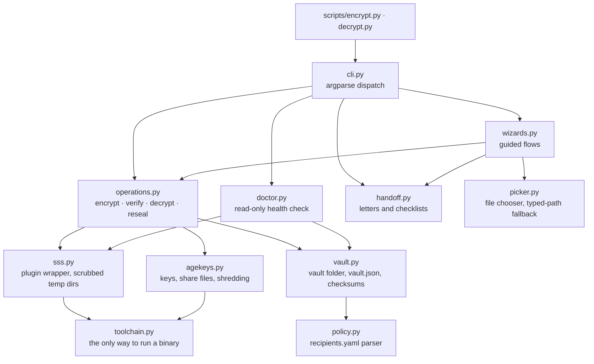

# Architecture

How the code is organised, how data moves through it, and why the less obvious
decisions were made. For what the tool protects against, see
[SECURITY.md](../SECURITY.md).

## The constraint that shapes everything

The decryption path will be run once, by someone non-technical and probably
grieving, years after it was written, with nobody to ask. So:

- every error is a plain sentence plus something to do next, and no traceback
  reaches the screen;
- every rejected input offers another try instead of ending the program;
- there is nothing to install beyond a Python interpreter and three binaries, or
  nothing at all when the owner hands out the compiled package;
- the files the tool writes stay readable, and usable, without the tool.

## One package, two thin entry points

`internals/digital_legacy/` holds everything. `internals/scripts/encrypt.py` and
`decrypt.py` are short shims that put `internals/` on `sys.path` and call
`digital_legacy.cli`; they exist because every launcher and every printed
instruction points at those paths.



Underneath all of them: `errors.py` (one exception hierarchy, each error carrying
a lay-reader message and an actionable hint), `console.py` (all terminal I/O) and
`layout.py` (every "which folder?" answer).

The first version of this project was two independent 500-line scripts, kept
separate on purpose so a beneficiary needed only one file. The copies drifted,
and each grew defects the other lacked. What was worth preserving — that a
beneficiary needs nothing but an interpreter — comes from having **no
third-party dependencies**, not from duplicating the code.

## Data flow

### Encrypt, then prove it

```mermaid
sequenceDiagram
    participant W as wizard / CLI
    participant K as age-keygen
    participant P as age-plugin-sss
    participant A as age
    W->>K: generate one X25519 keypair per share
    W->>W: write public keys + threshold to recipients.yaml
    W->>P: --generate-recipient
    P-->>W: one composite recipient
    W->>A: age -e -r recipient → name.partial
    W->>W: rename .partial on success
    rect rgba(63,185,80,0.15)
    note over W,A: verification, mandatory
    W->>P: --generate-identity from a random threshold-sized subset
    W->>A: age -d -i identity → scrubbed temp file
    W->>W: SHA-256 equals the source?
    end
    W->>W: only now report success; write key files and letters
```

The shaded block is the reason the tool can be trusted. An earlier version
printed "Encryption completed successfully!" and left proving it to the
bereaved. The subset is random so that repeated runs exercise different
combinations of keys.

### Decrypt

1. Each key file's secret is derived to its public key and checked for membership
   in `recipients.yaml`. This is not a cryptographic test; it exists so that a
   wrong file produces a readable error immediately, not a cryptic `age` failure
   after every key has been gathered.
2. With enough distinct keys, `age-plugin-sss --generate-identity` combines them
   inside a 0700 temporary directory.
3. `age -d -i` decrypts. A real failure is still caught from `age`'s stderr, and
   the empty output file `age` had already created is shredded.
4. The recovered file is checksummed against `vault.json` when one exists, and
   written to the Desktop as `[SENSITIVE] <name> - Decrypted <date><ext>`.

### Reseal

Shamir shares cannot be revoked or added; the threshold is sealed into the
ciphertext. Changing who holds keys therefore means decrypting and encrypting
again, which `reseal` does without the plaintext leaving a scrubbed temporary
directory: decrypt with the current keys, encrypt under the new policy, verify,
then delete the old ciphertext.

## Decisions worth recording

**Standard library only.** No runtime dependencies, and none should be added.
`recipients.yaml` must be YAML because the plugin consumes it, so `policy.py`
contains a strict line-by-line parser for exactly the subset this tool writes,
which rejects what it does not understand and names the line. Everything else
the tool writes is JSON. Tests use `unittest` so the suite has the same footprint
as the shipped code.

**`Toolchain.run` is the only way to run a binary.** `age` finds plugins by
looking up `age-plugin-<name>` on `PATH`, so every subprocess needs the binaries
directory prepended. Centralising it means no call site can forget. The
directory must also be **absolute**: Go's `exec.LookPath` refuses a hit that
resolves inside the current directory, so a relative entry breaks decryption
outright.

**The vault stores the filename stem and extension separately.** Re-deriving an
extension by splitting a display name like `taxes 2024.1 - Encrypted 2025-05-26`
once produced files nothing could open.

**More than one `.yaml` in the vault is fatal; more than one `.age` is not.**
Guessing which policy applies could encrypt to the wrong people, so the tool
refuses. Guessing is unnecessary for ciphertexts: the wizard asks which to open.

**`vault.json` is optional.** Vaults from before 2.0 still open through a
filename parser, and a damaged manifest never blocks decryption. Metadata must
not become a new way to lose the document.

**Reseal deletes the old ciphertext, and never deletes a key file.** Leaving the
old file means every removed keyholder can still open it and the reseal achieved
nothing. Key files are the opposite case: the folder may hold a share for another
vault, and destroying a secret on a guess is irreversible, so stale keys are
named for the owner to deal with. That check runs after the new shares are
written, or it would name files about to be overwritten.

**Secrets travel over stdin, never argv.** Key files are created with `O_EXCL`
and mode 0600, with `icacls` stripping inherited access on Windows, and are
overwritten before being unlinked. Anything the binaries print is passed through
a redactor before it can reach the screen.

**Progress is reported by a context manager.** `console.task(...)` prints "Done"
or "Failed" according to whether its block raised. Nothing passes a hardcoded
success, which is how the old code came to print "Done" for work that had failed.

**The compiled program finds its vault through `sys.executable`.** In a Nuitka
standalone build `__file__` points into the program folder,
`__compiled__.containing_dir` is one level too high, and Windows may hand back an
8.3 short path. The release builder therefore runs the health check *through the
staged executable* from an unrelated working directory, which is the check that
catches a package unable to find its own document.

## Testing

Two layers. A `FakeToolchain` exercises parsing, validation, naming and error
handling anywhere, quickly. Integration tests run the real binaries and skip
themselves when those are absent, which is the state of a fresh clone; CI fetches
pinned, checksum-verified releases so they run there.

The wizards are driven end to end by a scripted console that answers from a
list, so the real interactive code runs unattended. One integration test decrypts
the sample vault committed in this repository, so the project's only worked
example cannot silently rot.

`tests/support.py` refuses to run against the working copy, and tests pass their
layout explicitly: an early draft let the CLI discover its own folder and
overwrote the sample vault.
